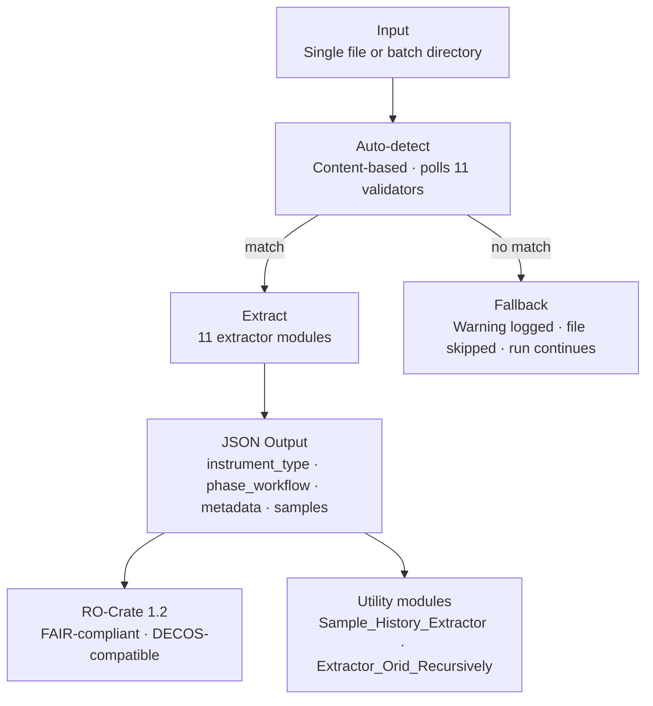

# LAGE Metadata Extraction Pipeline

<div align="center">

[](https://github.com/RitAreaSciencePark/LAGE_Metadata_Extraction)


**Automated metadata extraction, normalisation, and FAIR packaging for sequencing data**  
*Laboratory of Genomics and Epigenomics (LAGE) · Area Science Park · Trieste, Italy*

</div>


## Overview

Sequencing laboratories generate large volumes of heterogeneous data across multiple instruments and deeply nested directory structures. Extracting, standardising, and tracking metadata manually is time-consuming, error-prone, and difficult to scale.

This project provides a **modular and extensible Python pipeline** for automatically extracting contextual and sample-level metadata from laboratory files and converting them into standardised JSON outputs. The pipeline also transforms raw laboratory outputs into FAIR-compliant, machine-actionable metadata packages using RO-Crate and JSON-LD technologies.

The system operates **post data generation**, focusing on metadata structuring, provenance tracking, traceability, interoperability, and long-term reusability.


### Key Features

- **Automatically identifies file types** based on file content, without requiring manual flags or user input
- **Processes single files or entire directory trees** using batch execution
- **Extracts both metadata and sample-level data** in a consistent and reproducible manner
- **Produces a unified JSON output schema** with five universal top-level fields across all supported platforms
- **Enables data lineage and sample history tracking** across projects, manifests, and processing runs
- **FAIR-compliant packaging using RO-Crate 1.2** (Findable, Accessible, Interoperable, Reusable)

>  The pipeline is a **FAIRification tool** — it operates post-hoc on completed datasets without requiring any modification to existing instrument workflows.

---

## Table of Contents

- [Supported Platforms](#supported-platforms)
- [Installation & Requirements](#installation--requirements)
- [Architecture](#architecture)
- [Modules](#modules)
- [Example Workflow and Outputs](#example-workflow-and-outputs)
- [FAIR Compliance](#fair-compliance)
- [Extending the Pipeline](#extending-the-pipeline)
- [References](#references)
- [License](#license)
- [Authors](#authors)

---

## Supported laboratory Platforms and files types

| Instrument | File Types | Extractor Module |
|---|---|---|
| Illumina NovaSeq6000 | SampleSheet `.csv`, Thermal Report, FM Generation, FM AutoTilt, Sample Report | `Extractor_IlluminaSampleSheet.py` · `Extractor_Thermal_Report.py` · `Extractor_FMGeneration.py` · `Extractor_FMAutoTilt.py` · `Extractor_SampleReport.py` |
| Oxford Nanopore PromethION | Sample sheet, final summary, sequencing summary, pore activity, throughput, temperature, pore scan, Markdown report, JSON report | `Extractor_Nanopore.py` |
| Illumina iScan (BeadStudio) | BeadStudio sample sheet `.csv` | `Extractor_BeadStudio.py` |
| NanoDrop Spectrophotometer | UV absorbance export `.csv` | `Extractor_NanoDrop_QC.py` |
| Agilent TapeStation | Analysis report `.pdf` | `Extractor_TapeStation.py` |
| FastQC (Babraham) | QC archive `.zip` | `Extractor_FastQC.py` |
| Lab sample sheet | Reception `.xlsx` | `Extractor_SampleSheet_xlsx.py` |

---

## Installation & Requirements


### Prerequisites


#### Hardware Requirements

- Multi-core CPU (≥ 4 cores recommended)
- Minimum 8 GB RAM (16 GB recommended for large Nanopore datasets)
- Sufficient storage for raw and processed data (SSD preferred)


#### Step 1. Clone the repository


```bash
git clone https://github.com/RitAreaSciencePark/LAGE_Metadata_Extraction.git
cd LAGE_Metadata_Extraction
```

#### Step 2. Create a virtual environment (recommended)

```bash
python3 -m venv venv
source venv/bin/activate        # Linux / macOS
venv\Scripts\activate           # Windows
```

#### Step 3. Install dependencies

```bash
pip install -r requirements.txt
```

#### Step 4. Verify installation

```bash
python3 ./Src/Main_Auto_Processor.py --help
```

### Component Map

All pipeline components are located in the `Src/` directory.
The five core scripts handle orchestration, lineage, and
packaging; the eleven extractor modules each target a specific
instrument or file format.

```
LAGE_Metadata_Extraction/
├── Input
├── Output
├── Src/
│   ├── Main_Auto_Processor.py          ← Central detection and routing engine
│   ├── Sample_History_Extractor.py     ← Cross-file sample provenance
│   ├── Extractor_Orid_Recursively.py   ← Project-level recursive scan
│   ├── Crate_Generator.py              ← RO-Crate 1.2 descriptor generator
│   ├── Main_Rocrate.py                 ← End-to-end extraction + packaging
│   │
│   ├── Extractor_BeadStudio.py
│   ├── Extractor_IlluminaSampleSheet.py
│   ├── Extractor_Thermal_Report.py
│   ├── Extractor_FMGeneration.py
│   ├── Extractor_FMAutoTilt.py
│   ├── Extractor_Nanopore.py
│   ├── Extractor_NanoDrop_QC.py
│   ├── Extractor_TapeStation.py
│   ├── Extractor_FastQC.py
│   ├── Extractor_SampleReport.py
│   └── Extractor_SampleSheet_xlsx.py
│
├── requirements.txt
└── README.md
```

## Architecture

The pipeline is organised into four component groups:

- **Central Manager** (`Main_Auto_Processor.py`) — orchestrates file
  detection, routing, and extraction using a Registry Pattern and
  Validation Polling. Acts as the entry point for all processing.

- **11 Extractor Modules** — each module handles one instrument or
  file format through content-based validation and a standardised
  `one_single_file()` extraction interface.

- **Utility and Lineage Modules**
  - `Extractor_Orid_Recursively.py` — navigates deeply nested project
    folders and flattens files associated with a specific ORID.
  - `Sample_History_Extractor.py` — aggregates and chronologically
    orders metadata across multiple runs to reconstruct sample
    provenance.

- **FAIR Packaging Modules**
  - `Crate_Generator.py` — generates a `ro-crate-metadata.json`
    descriptor linking files to instruments, activities, and the
    institutional hierarchy (Area Science Park → RIT → LAGE/LADE).
  - `Main_Rocrate.py` — end-to-end pipeline combining extraction and
    RO-Crate packaging in a single execution step.

### Workflow

The pipeline follows a structured four-step processing workflow.
Files that do not match any registered extractor are safely
skipped via a fallback mechanism, with a warning logged for
each — execution continues without interruption.

```
┌─────────────────────────────────────────────────────────────────────────┐
│                        LAGE Metadata Pipeline                           │
├──────────────┬──────────────────────┬──────────────────┬───────────────┤
│   ① INPUT    │   ② AUTO-DETECT     │   ③ EXTRACT     │  ④ OUTPUT     │
├──────────────┼──────────────────────┼──────────────────┼───────────────┤
│ Single file  │ Content-based        │ 11 specialised   │ Unified JSON  │
│ or batch dir │ detection engine     │ extractor        │ + RO-Crate    │
│              │ (not filename-based) │ modules          │ 1.2           │
│ .csv .xlsx   │                      │                  │               │
│ .pdf .json   │ Polls 11 validators  │ one_single_      │ DECOS-        │
│ .pod5 .zip   │ sequentially until   │ file() interface │ compatible    │
│ .txt .md ... │ a match is found     │                  │               │
│              │          │           │                  │               │
│              │    No match?         │                  │               │
│              │    ↓ Fallback        │                  │               │
│              │    Warning logged    │                  │               │
│              │    File skipped      │                  │               │
│              │    Run continues     │                  │               │
└──────────────┴──────────────────────┴──────────────────┴───────────────┘
```



### Conceptual Design

The pipeline is built on three core principles:

1. **Automation** — File types are detected dynamically based on content, without user input
2. **Modularity** — Each file format is handled by a dedicated extractor module; new platforms can be added without modifying the core engine
3. **Traceability** — Outputs preserve project identifiers and enable reconstruction of sample history across runs and platforms

---

## Modules

### Central Manager (`Main_Auto_Processor.py`)

This script is a centralised manager designed to handle the complexity of scaling across many different file types. Instead of hard-coding logic for every format, it uses a **Registry Pattern** combined with **Validation Polling**.

#### What It Does

- Automatically detects file types based on file content
- Routes files to the appropriate extractor module
- Supports single-file and recursive batch processing
- Applies normalisation utilities (`normalise_date`, platform canonicalisation)
- Ensures standardised JSON output across all formats

#### How It Works

For each encountered file:

1. **Validation** — each registered extractor's validation function is evaluated sequentially
2. **Routing** — the extractor returning `True` is selected to handle the extraction
3. **Extraction** — `one_single_file()` is called to parse metadata and return structured JSON
4. **Fallback** — if no module recognises the file, it is logged with a warning and skipped; execution continues

#### Inputs & Outputs

- **Inputs**
  - A single file, **or**
  - A directory containing files or nested folders

- **Outputs**
  - Standardised JSON files containing `file_name`, `file_path`, `file_description`, `instrument_type`, `phase_workflow`, `metadata`, and `samples`
  - A processing summary report printed to stdout

#### Usage

**Batch mode:**

```bash
python3 ./Src/Main_Auto_Processor.py <input_folder> <output_folder> --batch
```

**Single file:**

```bash
python3 ./Src/Main_Auto_Processor.py <input_file.csv> <output_folder>
```

---

### Extractor Modules

Each extractor module follows a consistent internal structure:

- `is_valid_type(file_path)` — content-based validation logic, independent of filename conventions
- `one_single_file(root_dir, output_dir, file_name)` — core extraction logic returning structured metadata

#### BeadStudio (`Extractor_BeadStudio.py`)

- Header and sample metadata extraction from `[Header]`, `[Manifests]`, and `[Data]` sections
- ORID identifier extracted from filename using regular expression
- Manifest identifier (`EPIC-8v2-0_A2.bpm`) recorded for array chemistry traceability

#### Illumina Sample Sheet (`Extractor_IlluminaSampleSheet.py`)

- Section-based parsing of `[Header]`, `[Reads]`, `[Settings]`, and `[Data]`
- Three-condition validation: simultaneous presence of `[Header]`, `Workflow,GenerateFASTQ`, and `Chemistry,Amplicon`
- Sample-to-project traceability via index sequences and well positions

#### Thermal Report (`Extractor_Thermal_Report.py`)

- Column remapping for semi-structured PCR output
- Instrument identifier, run side, and date extracted directly from filename
- ORID extraction where present

#### FM Generation and FM AutoTilt (`Extractor_FMGeneration.py` · `Extractor_FMAutoTilt.py`)

- Dynamic multi-section extraction strategy for pre-run optical calibration files
- Two-column sections stored as lists of dictionaries; multi-column sections as row records
- Instrument ID and date parsed from filename via regular expression

#### NanoDrop QC (`Extractor_NanoDrop_QC.py`)

- Validates four required column headers: `Sample.ID`, `ng.ul`, `260.280`, `260.230`
- Renames `Sample.ID` → `Sample_ID` (dot-to-underscore normalisation)
- Spectral columns (220–360 nm) discarded; quality thresholds recorded for interpretation

#### TapeStation (`Extractor_TapeStation.py`)

- PDF parsed using `pdfplumber`; validated by signature string `"TapeStation Analysis Software"`
- Sample Table identified by `Well` and `DIN` column headers
- DIN quality threshold (≥ 7.0) and software version recorded

#### Nanopore (`Extractor_Nanopore.py`)

- Handles 9 distinct MinKNOW file sub-types through content inspection
- **Incremental aggregation strategy** — maintains one `Generalized_metadata.json` per run, updated as each file is processed
- Supports: `sample_sheet`, `final_summary`, `sequencing_summary`, `pore_activity`, `throughput`, `temperature`, `pore_scan`, `report_in_markdown`, `json_report`

#### FastQC (`Extractor_FastQC.py`)

- Validates ZIP archive by checking for `_fastqc.zip` suffix or `fastqc_data.txt` internally
- Extracts version, total sequences, GC percentage, and encoding from `fastqc_data.txt`
- Records originating FASTQ file path and MD5 checksum in `derived_from` field (satisfies FAIR sub-principle R1.2)

#### SampleSheet xlsx (`Extractor_SampleSheet_xlsx.py`)

- Processes reception sample sheets in Excel format
- Extracts sample identifiers, preparation types, and plate layout from `Samples` and `PlateScheme` sheets

#### Sample Report (`Extractor_SampleReport.py`)

- Processes manually generated semicolon-delimited CSV files documenting technical observations
- Validated by inspection of column headers rather than file extension

---

## Lineage Modules

### Sample History Extractor (`Sample_History_Extractor.py`)

This script builds a **chronological history** for a specific sample by aggregating all its occurrences across generated JSON metadata files.

#### What It Does

- Scans all JSON files in a directory recursively, including nested subdirectories
- Identifies all entries associated with the queried sample using flexible suffix matching
- Aggregates metadata and sample-level values across multiple source files
- Orders records chronologically from oldest to newest
- Normalises `Sample_ID` and `Sample_Name` to lowercase `sample_id` and `sample_name` throughout
- Produces a single consolidated history file
- Prints a summary report: files scanned, entries found, date range, output path

#### Why It's Useful

- Tracks sample re-runs across time and platforms
- Resolves prefix variations automatically — querying `E03` matches `E03`, `its-E03`, and `16s-E03`
- Preserves data lineage across projects and manifests
- Simplifies auditing, reproducibility, and downstream analytical workflows

#### Inputs & Outputs

- **Inputs**
  - Directory containing generated JSON metadata files
  - `Sample_ID` or `Sample_Name` to track (e.g. `E03`, `its-A01`)

- **Outputs**
  - A unified history file: `History_<SampleID>.json`

#### Usage

```bash
python3 ./Src/Sample_History_Extractor.py <path/to/json_folder>  <sample_id>  <path/to/output_folder>
```

---

### Recursive ORID Scanner (`Extractor_Orid_Recursively.py`)

Processes all files associated with a specific project identifier (ORID), supporting direct filename matching and deep directory inheritance.

#### What It Does

- Navigates through all nested subdirectories starting from the input folder
- Identifies files using a dual-layer matching strategy:
  - **Direct filename match** — ORID present in the filename (e.g. `ORID0036_data.csv`)
  - **Directory-based inheritance** — file located anywhere inside a folder labelled with the ORID (e.g. `post_run/ORID0036/CSVs/data.csv`)
- Passes all identified files through `Main_Auto_Processor` for validation and metadata extraction
- Flattens the resulting JSON files into a single target directory

#### Why It's Useful

- Ideal for structures where the ORID is defined at a high level but data is stored several levels deep in generic sub-folders such as `CSVs/` or `Raw/`
- Optimised for fast sample history extraction across large, multi-project datasets

#### Inputs & Outputs

- **Inputs**
  - Input directory: the top-level folder to begin the recursive search
  - ORID identifier: the specific project code to filter for (e.g. `ORID0036`)

- **Outputs**
  - JSON metadata files for the specified ORID, stored in a single output directory

#### Usage

```bash
python3 ./Src/Extractor_Orid_Recursively.py  <path/to/input_folder>  <ORID_number> <path/to/output_json_folder>
```

---

## FAIR Packaging Modules


### RO-Crate Generator (`Crate_Generator.py`)

Generates a formal [RO-Crate](https://www.researchobject.org/ro-crate/) metadata descriptor (`ro-crate-metadata.json`) for all data files within a project folder, independently of directory depth.

#### What It Does

- Recursively scans the input directory to identify all supported files
- Preserves the relative folder structure in the metadata graph
- Encodes the institutional hierarchy: Area Science Park → RIT → LAGE / LADE
- Links every file entity to its generating sequencing activity via `actionProcess`
- Links every file entity to the curation software via `wasGeneratedBy`
- Declares RO-Crate 1.2 compliance via `conformsTo` and `@context`

#### Why It's Useful

- Makes lab data **Findable, Accessible, Interoperable, and Reusable** through machine-readable context
- Produces JSON-LD compatible with international data repositories and the DECOS platform
- Clearly identifies institutional owners, instruments, and software tools associated with the dataset
- Validated via the [RO-Crate Playground](https://www.researchobject.org/ro-crate/specification/1.2/)

#### Inputs & Outputs

- **Inputs**
  - Root directory containing raw data files (recursively scanned)

- **Outputs**
  - `ro-crate-metadata.json` placed in the root of the input directory

#### Usage

```bash
python3 ./Src/Crate_Generator.py <path/to/input_data_folder>
```

---

### Integrated RO-Crate Pipeline (`Main_Rocrate.py`)

Provides an end-to-end pipeline combining metadata extraction and RO-Crate generation into a single executable step. It incorporates the full `Main_Auto_Processor` workflow.

#### What It Does

- Recursively scans the input directory to identify raw data files
- Processes all files through `Main_Auto_Processor` to generate standardised JSON metadata
- Collects all generated JSON files within the output directory
- Produces the `ro-crate-metadata.json` descriptor from the resulting metadata

#### Why It's Useful

- Eliminates the need to run extraction and packaging as separate steps
- Ensures consistency between extracted metadata and the final RO-Crate descriptor
- Simplifies large-scale data processing workflows in sequencing environments

#### Inputs & Outputs

- **Inputs**
  - Input directory containing raw data files
  - Output directory for generated metadata and RO-Crate packaging

- **Outputs**
  - Standardised JSON metadata files
  - `ro-crate-metadata.json` placed in the output directory

#### Usage

```bash
python3 ./Src/Main_Rocrate.py <path/to/input_data_folder>  <path/to/output_data_folder> --batch
```

---

## Example Workflow and Outputs

The following commands illustrate a complete end-to-end
processing workflow using the ORID0087 dataset
(Illumina NovaSeq6000 · 16S rRNA + ITS amplicon sequencing).

---

### Step 1 — Batch metadata extraction

```bash
python3 ./Src/Main_Auto_Processor.py  ./Input/ORID0087 ./Input/ORID0087/Jsons --batch
```

Produces one standardised JSON file per recognised input file.
<details>
<summary>📄 View JSON output example — FastQC extractor</summary>

```json
{
    "instrument_type": "FastQC_Babraham_Software",
    "phase_workflow": "Post_Sequencing_QC",
    "file_name": "16s-A01_S56_L001_R1_001_fastqc.zip",
    "file_type": "fastqc quality control",
    "file_path": "./Input/ORID0087/ORID0087-02--16S/FASTQC/16s-A01_S56_L001_R1_001_fastqc.zip",
    "file_description": "FastQC quality control report archive containing per-read quality metrics derived from a FASTQ file.",
    "tool": {
        "name": "FastQC",
        "version": "0.12.1"
    },
    "encoding": "Sanger / Illumina 1.9",
    "sample_id": "16s-A01",
    "total_sequences": 731058,
    "sequence_length": "35-251",
    "gc_percent": 56,
    "derived_from": {
        "fastq_file_name": "16s-A01_S56_L001_R1_001.fastq.gz",
        "fastq_path": "./Input/ORID0087/ORID0087-02--16S/16s-A01_S56_L001_R1_001.fastq.gz",
        "fastq_checksum_md5": "319adf176b35a9c578b5789e8b82ba30"
    }
}
```

</details>

 
### Step 2 — Sample history reconstruction

```bash
python3 ./Src/Sample_History_Extractor.py ./Input/ORID0087/Jsons  E03  ./Input/ORID0087//History/
```

Produces `History_E03.json` — a consolidated, chronologically
ordered provenance file aggregating all metadata entries
associated with sample `E03`. Query `E03` matches entries
recorded as `E03`, `its-E03`, and `16s-E03` via flexible
suffix matching across both 16S and ITS sequencing targets.

<details>
<summary>📄 View History_E03.json </summary>

```json
[
  {
    "instrument_type": "FastQC_Babraham_Software",
    "phase_workflow": "Post_Sequencing_QC",
    "file_name": "its-E03_S172_L001_R2_001_fastqc.zip",
    "file_type": "fastqc quality control",
    "file_path": "./Input/ORID0087/ORID0087-02--ITS/FASTQC/its-E03_S172_L001_R2_001_fastqc.zip",
    "file_description": "FastQC quality control report archive containing per-read quality metrics derived from a FASTQ file.",
    "tool": {
      "name": "FastQC",
      "version": "0.12.1"
    },
    "encoding": "Sanger / Illumina 1.9",
    "sample_id": "its-E03",
    "total_sequences": 787786,
    "sequence_length": "35-251",
    "gc_percent": 52,
    "derived_from": {
      "fastq_file_name": "its-E03_S172_L001_R2_001.fastq.gz",
      "fastq_path": "./Input/ORID0087/ORID0087-02--ITS/FASTQC/its-E03_S172_L001_R2_001.fastq.gz",
      "fastq_checksum_md5": "Unknown"
    }
  },
  {
    "instrument_type": "FastQC_Babraham_Software",
    "phase_workflow": "Post_Sequencing_QC",
    "file_name": "16s-E03_S76_L001_R2_001_fastqc.zip",
    "file_type": "fastqc quality control",
    "file_path": "./Input/ORID0087/ORID0087-02--16S/FASTQC/16s-E03_S76_L001_R2_001_fastqc.zip",
    "file_description": "FastQC quality control report archive containing per-read quality metrics derived from a FASTQ file.",
    "tool": {
      "name": "FastQC",
      "version": "0.12.1"
    },
    "encoding": "Sanger / Illumina 1.9",
    "sample_id": "16s-E03",
    "total_sequences": 821490,
    "sequence_length": "35-251",
    "gc_percent": 54,
    "derived_from": {
      "fastq_file_name": "16s-E03_S76_L001_R2_001.fastq.gz",
      "fastq_path": "./Input/ORID0087/ORID0087-02--16S/FASTQC/16s-E03_S76_L001_R2_001.fastq.gz",
      "fastq_checksum_md5": "Unknown"
    }
  },
  {
    "source_file": "20260122_ORID0087C-02_campioni_originali_Zaccardelli.csv",
    "file_type": "Experimental Sample Sheet related to the quality control of the samples before the sequencing step",
    "extraction_metadata": {},
    "manifest_id": null,
    "sample_details": {
      "concentration_ng_ul": 426.295,
      "ratio_260_280": 1.79,
      "ratio_260_230": 1.17,
      "sample_id": "E03"
    }
  },
  {
    "source_file": "SampleSheet.xlsx",
    "file_type": "Experimental Sample Sheet (SampleSheet.xlsx) related to the samples and Plate scheme description ",
    "extraction_metadata": {
      "preparations_detected": [
        "Compost",
        "CTA",
        "CTNA",
        "Tecukana liquid L7",
        "Tecukana liquid L8",
        "Tecukana liquid L9"
      ],
      "treatments_detected": [
        "None",
        "Sugar 20 g/L"
      ]
    },
    "manifest_id": null,
    "sample_details": {
      "Sample code": 21,
      "Type of preparation": "Compost",
      "Treatment": "None",
      "Replicate": 1,
      "sample_id": "E03"
    }
  },
  {
    "instrument_type": "FastQC_Babraham_Software",
    "phase_workflow": "Post_Sequencing_QC",
    "file_name": "16s-E03_S76_L001_R1_001_fastqc.zip",
    "file_type": "fastqc quality control",
    "file_path": "./Input/ORID0087/ORID0087-02--16S/FASTQC/16s-E03_S76_L001_R1_001_fastqc.zip",
    "file_description": "FastQC quality control report archive containing per-read quality metrics derived from a FASTQ file.",
    "tool": {
      "name": "FastQC",
      "version": "0.12.1"
    },
    "encoding": "Sanger / Illumina 1.9",
    "sample_id": "16s-E03",
    "total_sequences": 821490,
    "sequence_length": "35-251",
    "gc_percent": 56,
    "derived_from": {
      "fastq_file_name": "16s-E03_S76_L001_R1_001.fastq.gz",
      "fastq_path": "./Input/ORID0087/ORID0087-02--16S/FASTQC/16s-E03_S76_L001_R1_001.fastq.gz",
      "fastq_checksum_md5": "Unknown"
    }
  },
  {
    "instrument_type": "FastQC_Babraham_Software",
    "phase_workflow": "Post_Sequencing_QC",
    "file_name": "its-E03_S172_L001_R1_001_fastqc.zip",
    "file_type": "fastqc quality control",
    "file_path": "./Input/ORID0087/ORID0087-02--ITS/FASTQC/its-E03_S172_L001_R1_001_fastqc.zip",
    "file_description": "FastQC quality control report archive containing per-read quality metrics derived from a FASTQ file.",
    "tool": {
      "name": "FastQC",
      "version": "0.12.1"
    },
    "encoding": "Sanger / Illumina 1.9",
    "sample_id": "its-E03",
    "total_sequences": 787786,
    "sequence_length": "35-251",
    "gc_percent": 53,
    "derived_from": {
      "fastq_file_name": "its-E03_S172_L001_R1_001.fastq.gz",
      "fastq_path": "./Input/ORID0087/ORID0087-02--ITS/FASTQC/its-E03_S172_L001_R1_001.fastq.gz",
      "fastq_checksum_md5": "Unknown"
    }
  },
  {
    "source_file": "20260129_ORID0087_C_ALL_INDEXES.csv",
    "file_type": null,
    "extraction_metadata": {
      "experiment_name": "20260130_ORID0087_C",
      "date": "20260130",
      "workflow": "GenerateFASTQ",
      "application": "FASTQ Only",
      "instrument_type": "NovaSeq",
      "assay": "Custom",
      "index_adapters": "Custom",
      "chemistry": "Amplicon",
      "proposal_id": "ORID0087"
    },
    "manifest_id": null,
    "sample_details": {
      "I7_Index_ID": "UDP0213",
      "index": "TTAGGATATC",
      "I5_Index_ID": "UDP0213",
      "index2": "CCATGGTATA",
      "Sample_Project": "ORID0087-02-16S",
      "sample_id": "16s-E03",
      "sample_name": "16s-E03"
    }
  },
  {
    "source_file": "20260129_ORID0087_C_ALL_INDEXES.csv",
    "file_type": null,
    "extraction_metadata": {
      "experiment_name": "20260130_ORID0087_C",
      "date": "20260130",
      "workflow": "GenerateFASTQ",
      "application": "FASTQ Only",
      "instrument_type": "NovaSeq",
      "assay": "Custom",
      "index_adapters": "Custom",
      "chemistry": "Amplicon",
      "proposal_id": "ORID0087"
    },
    "manifest_id": null,
    "sample_details": {
      "I7_Index_ID": "UDP0309",
      "index": "TTAAGACAAG",
      "I5_Index_ID": "UDP0309",
      "index2": "CAATTAAGCC",
      "Sample_Project": "ORID0087-02-ITS",
      "sample_id": "its-E03",
      "sample_name": "its-E03"
    }
  }
]
```

> The full history file comprises 8 chronologically ordered
> entries. `sample_id` is normalised to lowercase throughout.

</details>

---

### Step 3 — FAIR RO-Crate packaging

```bash
python3 ./Src/Crate_Generator.py ./Input/ORID0087
```

Generates `ro-crate-metadata.json` at the dataset root,
compliant with RO-Crate 1.2.

<details>
<summary>📄 View ro-crate-metadata.json excerpt</summary>

```json
{
  "@context": "https://w3id.org/ro/crate/1.2/context",
  "@graph": [
    {
      "@id":          "ro-crate-metadata.json",
      "@type":        "CreativeWork",
      "about":        { "@id": "./" },
      "conformsTo":   { "@id": "https://w3id.org/ro/crate/1.2" }
    },
    {
      "@id":            "./",
      "@type":          "Dataset",
      "name":           "LAGE Experimental Dataset for the Repository: ORID0087",
      "description":    "Main data directory containing 822 files generated through the sequencing process.",
      "license":        "https://opensource.org/licenses/MIT",
      "datePublished":  "2026-05-02",
      "humanReadableSize": "843.65 MB",
      "hasPart": [
        { "@id": "SampleSheet.xlsx" },
        { "@id": "20260129_ORID0087_C_ALL_INDEXES.csv" },
        { "@id": "QualityCheckBeforeRun/" },
        { "@id": "ORID0087-02--16S/" },
        { "@id": "ORID0087-02--ITS/" }
      ]
    },
    {
      "@id":           "#novaseq-device",
      "@type":         "Device",
      "name":          "Illumina NovaSeq 6000",
      "manufacturer":  "Illumina",
      "model":         "NovaSeq 6000",
      "url":           "https://www.illumina.com/systems/sequencing-platforms/novaseq.html"
    },
    {
      "@id":        "#novaseq-sequencing-activity",
      "@type":      "CreateAction",
      "name":       "Illumina NovaSeq Sequencing Run",
      "instrument": { "@id": "#novaseq-device" }
    },
    {
      "@id":          "#Crate_Generator",
      "@type":        "SoftwareApplication",
      "name":         "LAGE Folder Descriptor Generator",
      "license":      "https://opensource.org/licenses/MIT",
      "url":          "https://github.com/RitAreaSciencePark/LAGE_Metadata_Extraction/blob/main/Src/Crate_Generator.py"
    }
  ]
}
```

> Each file entity in the full descriptor carries
> `actionProcess` linking it to the sequencing activity,
> and `wasGeneratedBy` linking it to `#Crate_Generator`.

</details>


> Each file entity carries `actionProcess` linking it to
> the sequencing activity and `wasGeneratedBy` linking it
> to `#Crate_Generator`.


---

## FAIR Compliance

| Principle | Implementation |
|---|---|
| **F1** | Each file entity assigned a unique `@id` as relative IRI within the RO-Crate |
| **F2** | Schema.org-typed entities with name, format, size, description, and provenance |
| **A1** | Metadata in standard JSON-LD, distributable via HTTP or portable ZIP archive |
| **A2** | `ro-crate-metadata.json` remains interpretable independently of data files |
| **I1** | Schema.org vocabulary declared in `@context` |
| **I3** | Typed semantic relations: `wasGeneratedBy`, `actionProcess`, `creator` |
| **R1.1** | MIT licence URI declared in root data entity |
| **R1.2** | Two-level provenance chain: sequencing activity + curation software |
| **R1.3** | RO-Crate 1.2 compliance verified via RO-Crate Playground |

---

## Extending the Pipeline

To add support for a new instrument or file format:

1. Create `Extractor_MyInstrument.py` in `Src/`
2. Implement two functions:
   - `is_my_instrument(file_path) → bool` — content-based validation
   - `one_single_file(root_dir, output_dir, file_name) → list` — extraction logic
3. Register the module in `Main_Auto_Processor.py`:

```python
import Extractor_MyInstrument

EXTRACTORS = [
    ...
    (Extractor_MyInstrument, "is_my_instrument"),
]
```

No other files need to be modified.


---

## Design Advantages

- Scalable for large datasets
- Extensible modular architecture — new platforms require only one new file
- Robust fallback handling — unknown files are skipped without crashing
- Interoperable outputs (JSON, RO-Crate 1.2, JSON-LD)
- Full sample traceability across platforms and runs

---


## References

- Soiland-Reyes et al. (2022). *Packaging research artefacts with RO-Crate.* Data Science. https://doi.org/10.3233/DS-210053
- Wilkinson et al. (2016). *The FAIR Guiding Principles for scientific data management and stewardship.* Scientific Data. https://doi.org/10.1038/sdata.2016.18
- Illumina (2026). NovaSeq 6000 System documentation.
- Oxford Nanopore Technologies (2026). MinKNOW software documentation.
- Tsoptio Fougang L. (2026).
Metadata Extraction and FAIR-Compliant Packaging Pipeline
for Sequencing Data.
Master Thesis — SISSA / Area Science Park.
---

## License


This project is distributed under the **MIT License**.  

cite the code : [](https://doi.org/10.5281/zenodo.20764267)

---

## Authors


### Lesly Tsoptio Fougang
- GitHub: [@Lesly4](https://github.com/Lesly4)
- Master in Data Management and Curation — SISSA

### Valerio Piomponi
- GitHub: [@valeriopiomponi](https://github.com/valeriopiomponi)
- Laboratory of Data Engineering (LADE)
- Area Science Park, Trieste, Italy

### Ornella Affinito
- Laboratory of Multi-Omic Sciences Area Sud (LAAS)
- Area Science Park, Trieste, Italy